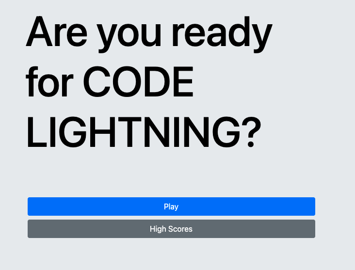

# Code Lightning

Code Lighting is an interactive quiz to test your coding knowledge. It was built on html, css, and javascript with a bit of bootstrap.

Here is a screenshot

The user is presented 5 dynamic questions and must answer them all in 60 seconds or less. If the user answers a question correctly, the button will turn green and they will get 100 points added to their score. If the user answers incorrectly, the button will turn red and remove 10 seconds from the remaining time. 

When a user has completed all questions or run out of time, they have the option to input their name and score into the high score board. 

Code Lightning was built by **Dan Evola**

For more info check out my [portfolio](http://dmevola.github.io/portfolio)